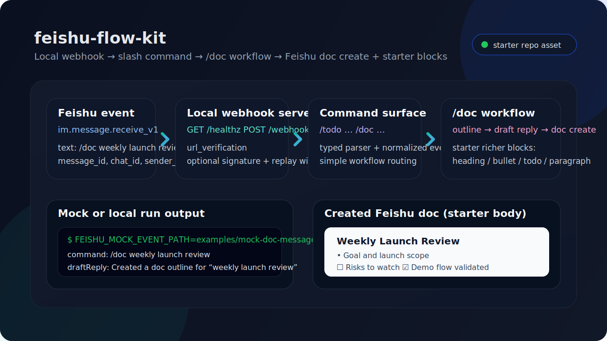
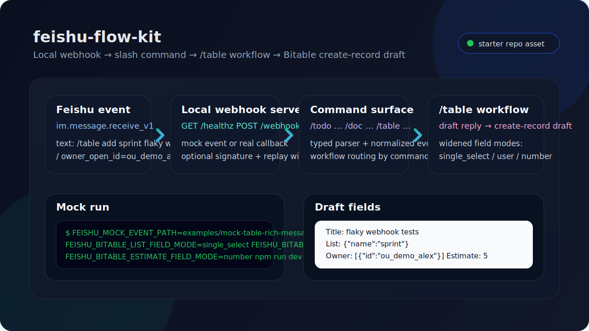
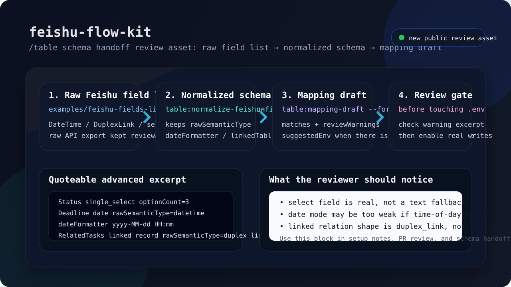
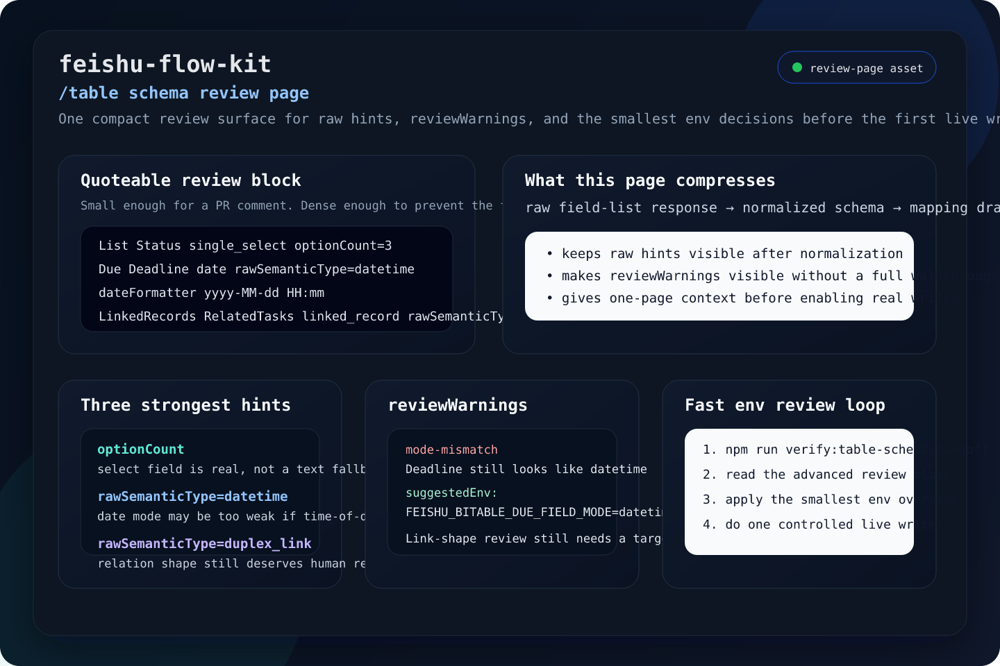
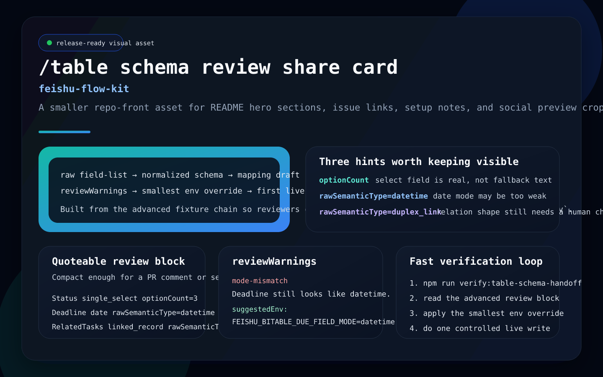

# feishu-flow-kit

[](https://github.com/learner20230724/feishu-flow-kit/actions/workflows/ci.yml) [](./LICENSE)

A local-first starter kit for building practical Feishu automations and AI workflows.

> English | [简体中文](./README.zh-CN.md)

## Why this exists

Most Feishu automation examples are either too narrow, too tied to one internal setup, or too heavy for people who just want to test a workflow quickly.

This project is a cleaner starting point:
- local-first
- easy to read
- useful without a lot of infrastructure
- ready to grow into real workflows

## What it is

`feishu-flow-kit` is a starter repository for building Feishu-centered tools such as:
- message-driven automations
- bot-triggered workflows
- Feishu document / table helpers
- lightweight AI-assisted internal tools
- local demos that can later be deployed properly

## Quick Start

**1. Install**
```bash
git clone https://github.com/learner20230724/feishu-flow-kit.git
cd feishu-flow-kit
npm install
```

**2. Create a Feishu app** at [open.feishu.cn/app](https://open.feishu.cn/app) with:
- Enable **Bot** capability
- Add **Permissions**: `im:message`, `docx:document`, `bitable:app`
- Under Event Subscriptions, enable `im.message.receive_v1`
- Set Request URL to your server (e.g. `https://your-host.com/webhook`)

**3. Configure** — copy `.env.example` to `.env` and fill in:

```bash
cp .env.example .env
# Edit .env with your Feishu app credentials
```

Key variables:
| Variable | Where to find it |
|---|---|
| `FEISHU_APP_ID` | Feishu app console → Credentials → App ID |
| `FEISHU_APP_SECRET` | Feishu app console → Credentials → App Secret |
| `FEISHU_VERIFICATION_TOKEN` | Settings → Event Subscriptions → Verification Token |
| `FEISHU_ENCRYPT_KEY` | Settings → Event Subscriptions → Encrypt Key (optional) |

**4. Run**
```bash
npm run dev          # local dev with mock events
npm start            # production (set FEISHU_* vars first)
```

Try these commands once your server is running:
- `/doc weekly launch review` → creates a Feishu doc with starter blocks
- `/table add backlog improve webhook errors / owner=alex` → drafts a Bitable record

To enable real Feishu API calls (not just drafts), set `FEISHU_ENABLE_OUTBOUND_REPLY=true`, `FEISHU_ENABLE_DOC_CREATE=true`, and/or `FEISHU_ENABLE_TABLE_CREATE=true` in `.env`.

For `/table` with your own Bitable, see the field mapping guide in [`docs/table-bitable-field-mapping.md`](./docs/table-bitable-field-mapping.md).

## Docker

A containerized image is published to GitHub Container Registry on every release and `main` push.

```bash
# Pull the latest release
docker pull ghcr.io/learner20230724/feishu-flow-kit:latest

# Run with your .env (server listens on port 8787 inside the container)
docker run -d --env-file .env -p 8787:8787 ghcr.io/learner20230724/feishu-flow-kit:latest

# Verify it's running
curl http://localhost:8787/healthz
```

For a full docker-compose setup with a public URL, see the [GHCR deployment guide](./docs/deployment.md#option-5--using-the-ghcr-image-directly).
# Or with docker-compose (recommended for production)
docker-compose up -d
```

See [`docs/deployment.md`](./docs/deployment.md) for full deployment guides (Railway, Render, fly.io, Ubuntu).

## MVP goals

- a small, understandable project structure
- typed config loading
- reusable Feishu event / message adapters
- basic structured logging
- one or two real example workflows
- no unnecessary platform ceremony

## Non-goals

- pretending to be a full platform SDK replacement
- hiding Feishu complexity behind too much abstraction
- forcing a server-heavy architecture for simple tasks

## Project structure

```text
.
  README.md
  README.zh-CN.md
  src/
    core/
    adapters/
    workflows/
    config/
    server/
    types/
  examples/
  docs/
```

## How it works

```
Feishu message event
        │
        ▼
┌───────────────────┐
│   POST /webhook   │  ← url_verification / im.message.receive_v1
│   (local server)  │
└────────┬──────────┘
         │ adapt raw payload
         ▼
┌───────────────────┐
│  slash-command    │  ← /todo ...  /doc ...  /table ...
│     parser        │
└────────┬──────────┘
         │ route to workflow
    ┌────┴──────────┬────┐
    ▼               ▼    ▼
 /todo            /doc  /table
  flow             flow   flow
    │               │      │
    │          create Feishu doc
    │          + append body blocks
    │                      │
    ▼               ▼      ▼
 draft reply JSON   doc draft   bitable create-record draft
  (+ optional outbound Feishu reply)
```

Everything above runs locally with mock events. Flip `FEISHU_ENABLE_OUTBOUND_REPLY=true`, `FEISHU_ENABLE_DOC_CREATE=true`, or `FEISHU_ENABLE_TABLE_CREATE=true` to switch selected paths from draft mode to real Feishu API calls. For `/table`, you can also widen field mapping incrementally with `FEISHU_BITABLE_LIST_FIELD_MODE=single_select` or `multi_select`, `FEISHU_BITABLE_OWNER_FIELD_MODE=user`, `FEISHU_BITABLE_ESTIMATE_FIELD_MODE=number`, `FEISHU_BITABLE_DUE_FIELD_MODE=date` or `datetime`, `FEISHU_BITABLE_DONE_FIELD_MODE=checkbox`, and `FEISHU_BITABLE_ATTACHMENT_FIELD_MODE=attachment`, or `FEISHU_BITABLE_LINK_FIELD_MODE=linked_record`. If your Bitable does not use the starter field names, you can now remap them directly with env vars such as `FEISHU_BITABLE_TITLE_FIELD_NAME=Task`, `FEISHU_BITABLE_LIST_FIELD_NAME=Stage`, or `FEISHU_BITABLE_SOURCE_COMMAND_FIELD_NAME=ChatCommand`.

## Demo assets











Five small static assets are included so the repo has a visible first-screen explanation even before someone runs the local server. The first two explain runnable paths, the third visualizes the schema handoff review flow, the fourth compresses the schema review page into a single screenshot-friendly asset, and the fifth is a share-card-sized variant that fits README hero crops, issue links, and setup-note embeds a bit better. There is now also a standalone HTML snapshot page at [`docs/table-schema-review-snapshot.html`](./docs/table-schema-review-snapshot.html) if you want a cleaner browser-render target for screenshots, issue links, or setup-note embeds, plus a release-facing asset index at [`docs/table-schema-review-assets.md`](./docs/table-schema-review-assets.md) if you want the quickest chooser for which review image to link or crop. If you need to refresh the PNG exports after editing the SVG sources, run `npm run docs:export-assets`. For one-off exports, `npm run docs:export-svg-png -- docs/demo-table-schema-handoff-review.svg --out docs/demo-table-schema-handoff-review.png`, `npm run docs:export-svg-png -- docs/demo-table-schema-review-page.svg --out docs/demo-table-schema-review-page.png`, and `npm run docs:export-svg-png -- docs/demo-table-schema-review-share-card.svg --out docs/demo-table-schema-review-share-card.png` are available.

## Local demo

```bash
npm install
npm run dev
```

By default the project runs in mock mode and loads `examples/mock-message-event.json`. You can switch demo inputs with `FEISHU_MOCK_EVENT_PATH`, for example:

```bash
FEISHU_MOCK_EVENT_PATH=examples/mock-doc-message-event.json npm run dev
FEISHU_MOCK_EVENT_PATH=examples/mock-table-message-event.json npm run dev
FEISHU_MOCK_EVENT_PATH=examples/mock-table-rich-message-event.json FEISHU_BITABLE_LIST_FIELD_MODE=multi_select FEISHU_BITABLE_OWNER_FIELD_MODE=user FEISHU_BITABLE_ESTIMATE_FIELD_MODE=number FEISHU_BITABLE_DUE_FIELD_MODE=datetime FEISHU_BITABLE_DONE_FIELD_MODE=checkbox FEISHU_BITABLE_ATTACHMENT_FIELD_MODE=attachment FEISHU_BITABLE_LINK_FIELD_MODE=linked_record npm run dev
```

The current demo path is:

1. load typed config
2. read a mock Feishu message event
3. parse a slash command like `/todo ...`, `/doc ...`, or `/table ...`
4. run a minimal workflow
5. print a draft reply

Starter commands available right now:
- `/todo ship webhook adapter`
- `/doc weekly launch review`
- `/table add backlog item: improve webhook errors / owner=alex`
- `/table add backlog improve webhook errors / owner_open_id=ou_xxx`
- `/table add sprint fix flaky webhook tests / estimate=5`
- `/table add sprint fix flaky webhook tests / due=2026-04-01`
- `/table add sprint close flaky webhook tests / done=true`
- `/table add sprint share demo pack / attachment_token=file_v2_demo123,file_v2_demo456`
- `/table add sprint,urgent flaky webhook tests / owner_open_id=ou_xxx / estimate=5 / due=2026-04-01T09:30:00Z / done=true`
- `/table add sprint ship follow-up / link_record_id=recA123,recB456`

If you already have a real Bitable field list JSON, you can also draft env mapping directly:

```bash
npm run table:mapping-draft -- examples/table-schema-sample.json
npm run table:mapping-draft -- examples/table-schema-partial.json --format json
npm run table:mapping-draft -- examples/table-schema-unmatched.json --format json --out ./table-mapping-draft.json
```

If what you have is a raw Feishu field-list response instead of a cleaned `fields` array, normalize it first. The normalized output now also keeps small raw-property review hints such as `rawSemanticType`, `dateFormatter`, `linkedTableId`, `optionCount`, and `sourceProperty`, so date-vs-datetime and linked-table semantics are less likely to disappear during handoff:

```bash
npm run table:normalize-feishu-fields -- examples/feishu-fields-list-response.json
npm run table:normalize-feishu-fields -- examples/feishu-fields-list-response.json --out ./table-schema-from-feishu.json
npm run table:mapping-draft -- ./table-schema-from-feishu.json --format json
npm run table:extract-select-option-review -- examples/feishu-fields-mapping-draft-advanced.json --format override
npm run table:validate-mapping-config -- ./table-schema-from-feishu.json
```

The mapping preflight accepts defaults from `process.env`, but it is usually more useful to point it at the exact rollout env you plan to ship:

```bash
npm run table:validate-mapping-config -- examples/feishu-fields-normalized-schema-advanced.json --env-file examples/table-mapping-advanced.env
npm run table:validate-mapping-config -- examples/feishu-fields-normalized-schema-advanced.json --env-file examples/table-mapping-advanced.env --strict-raw
```

Use the normal mode when you want a softer review gate that still surfaces raw-semantic drift like `datetime`→`date` or `DuplexLink`→`linked_record` as warnings. Add `--strict-raw` when you want release or CI to fail on those drifts instead of only printing them.

The repo also includes two full handoff fixture chains you can inspect directly:
- `examples/feishu-fields-list-response.json` / `examples/feishu-fields-normalized-schema.json` / `examples/feishu-fields-mapping-draft.json` → baseline raw-response-to-review-artifact chain
- `examples/feishu-fields-list-response-advanced.json` / `examples/feishu-fields-normalized-schema-advanced.json` / `examples/feishu-fields-mapping-draft-advanced.json` → advanced raw-fidelity chain with one short quoteable excerpt you can reuse in setup notes, PR review, or schema handoff comments when you need to show `optionCount`, `datetime` formatter drift, and `DuplexLink` relation shape without pasting the whole file

And if you want to quickly confirm that the committed handoff artifacts still match current CLI behavior across both chains, including the standalone select-option override sample and its minimal shape contract:

```bash
npm run verify:table-schema-handoff
```

Use the default env output when you want something easy to paste into `.env`. Use `--format json` when you want to review matches structurally, feed the result into another script, or keep unmatched fields in a machine-readable draft. The JSON draft now also includes a small `reviewWarnings` section for the handoff signals most likely to cause real-table surprises: select option-set review, raw-vs-normalized datetime drift, and linked-record relation-shape review. Each warning carries `reviewAction`, `suggestedEnv`, and `reviewChecklist` hints so the reviewer can see the next move without opening a separate note, and the select-option warning now also carries a tiny `optionLabelSample` plus a trimmed `sourcePropertyExcerpt` so reviewers can spot likely label drift without reopening the raw export. For the select case specifically, the same JSON draft now also emits `selectOptionReviewDrafts`, a smaller rollout-ready subset you can paste into setup notes or a lightweight override layer without filtering the whole warning list yourself; its `optionRemapDraft` now also includes a tiny `overrideExample` label→option-id map so the rollout asset is directly copyable instead of only reviewable. Env output now renders the same warning block once with inline action hints and select label samples. The input shape and sample variants are documented in [`/table` mapping generator input guide](./docs/table-mapping-generator-inputs.md), the end-to-end review path is shown in [`/table` schema handoff demo](./docs/table-schema-handoff-demo.md), the smaller select rollout asset is split out in [`/table` select-option handoff asset](./docs/table-select-option-handoff.md), the intended minimal override contract now lives in [`/table` select-option override schema draft](./docs/table-select-option-override-schema.md), there is now also a compact [`/table` schema review page](./docs/table-schema-review-page.md) for quoteable review snippets and quick `.env` decisions, a dedicated [`/table` mapping config preflight`](./docs/table-mapping-config-preflight.md) page for rollout-time env/schema validation, and the manual review gate is written down in [`/table` schema handoff review checklist](./docs/table-schema-handoff-review-checklist.md).

Example mock inputs:
- `examples/mock-message-event.json` → `/todo` flow
- `examples/mock-doc-message-event.json` → `/doc` flow
- `examples/mock-table-message-event.json` → `/table` text-first flow
- `examples/mock-table-rich-message-event.json` → `/table` richer field-mode flow (`multi_select` + `user` + `number` + `datetime` + `checkbox` + `attachment` + `linked_record`)
- `examples/webhook-table-rich-event.json` + `examples/webhook-table-rich-response.json` → fixture-backed `/table` webhook success sample
- `examples/webhook-invalid-payload.json` + `examples/webhook-invalid-response.json` → fixture-backed invalid webhook failure sample
- `examples/table-api-error-field-not-found.json` → fixture-backed missing-column failure sample
- `examples/table-api-error-type-mismatch.json` → fixture-backed field-type mismatch sample
- `examples/table-api-error-permission-denied.json` → fixture-backed Bitable write-permission failure sample
- `examples/table-schema-sample.json` / `examples/table-schema-partial.json` / `examples/table-schema-localized.json` / `examples/table-schema-unmatched.json` → mapping generator input samples for happy-path, partial rollout, localized column names, and unmatched-column review
- `examples/feishu-fields-list-response.json` / `examples/feishu-fields-normalized-schema.json` / `examples/feishu-fields-mapping-draft.json` → raw-response-to-review-artifact schema handoff fixture chain

This is intentionally small, but it proves the repo can move real input through a readable local pipeline.

## Current webhook slice

There is now a minimal local webhook path for Feishu message events.

Current scope:
- `GET /healthz` for quick local liveness checks
- `POST /webhook`
- handles `url_verification`
- accepts a minimal `im.message.receive_v1` payload
- adapts the raw callback into the repo's internal `message.received` event
- runs the existing demo workflow and returns draft reply data as JSON
- can optionally send a real Feishu text reply when `FEISHU_ENABLE_OUTBOUND_REPLY=true` and app credentials are present
- can optionally create a real Feishu doc from the `/doc` workflow when `FEISHU_ENABLE_DOC_CREATE=true` and app credentials are present
- after doc creation, can also append a small starter body with native heading / bullet / todo / paragraph blocks so the new doc is not left empty
- rejects non-POST requests on `/webhook` with a clear `405` response
- optionally verifies `x-lark-request-timestamp` + `x-lark-signature` when `FEISHU_WEBHOOK_SECRET` is configured
- rejects signed requests outside a configurable replay window

Current limits:
- signature verification is still intentionally small and not meant to replace a production-grade security review
- outbound reply sending is intentionally opt-in and only covers the simplest text reply path right now
- doc creation is still intentionally small; after the initial `docx/v1/documents` create call it can append starter heading / bullet / todo / paragraph blocks, and it now preserves inline markdown formatting — **bold**, *italic*, `inline code`, ~~strikethrough~~, and `[text](url)` links — inside paragraph, bullet, todo, and heading text
- token caching is currently only a tiny in-memory starter cache; there is still no refresh daemon, persistence layer, or concurrency dedupe
- only a narrow message payload is covered right now

That is enough for local debugging and repo-level structure validation, but it is still a starter implementation.

## Tests

```bash
npm run check
npm test
```

The current test set covers:
- slash command parsing
- demo message workflow behavior for `/todo`, `/doc`, and `/table`
- webhook payload adaptation
- webhook signature generation and validation
- outbound reply request draft generation
- minimal tenant token fetch + text reply sender flow
- minimal Feishu doc create request and starter richer-block append path for webhook `/doc` flow
- minimal Bitable create-record request and opt-in webhook `/table` write path
- local HTTP behavior for `GET /healthz` and `POST /webhook`

## Example workflow ideas

Already runnable in the repo:
- `/todo ...` → turns a request into a small action-list draft
- `/doc ...` → turns a topic into a markdown-style outline, then can create a Feishu doc and append a minimal native docx body (headings / bullets / todos / paragraphs)
- `/table ...` → turns a short record request into a Bitable create-record draft (local-first, opt-in outbound write; starter support for `List` single-select or multi-select payloads, `Owner` user payloads, `Estimate` numeric payloads, `Due` date/datetime timestamp payloads, `Done` checkbox payloads, `Attachment` file-token payloads, and `LinkedRecords` linked-record payloads is now available via config, and the starter field names can now be remapped to a real table schema without editing code)

Still good next candidates:
- sync selected Feishu content into a local markdown workspace
- trigger a small approval helper from structured chat commands

## Why local-first

For early-stage tools, local-first keeps iteration fast:
- less setup
- fewer moving parts
- easier debugging
- better fit for public examples

You can always add deployment pieces later.

## Docs

- [Setup guide](./docs/setup-guide.md)
- [Architecture overview](./docs/overview.md)
- [Deployment guide](./docs/deployment.md) — Railway, Render, fly.io, and manual Ubuntu
- [Table / Bitable field mapping notes](./docs/table-bitable-field-mapping.md)
- [`/table` schema mapping worksheet](./docs/table-schema-mapping-worksheet.md)
- [`/table` mapping generator input guide](./docs/table-mapping-generator-inputs.md)
- [`/table` schema handoff demo](./docs/table-schema-handoff-demo.md)
- [`/table` schema review page](./docs/table-schema-review-page.md)
- [`/table` mapping config preflight](./docs/table-mapping-config-preflight.md)
- [`/table` select-option handoff asset](./docs/table-select-option-handoff.md)
- [`/table` webhook success / error demo](./docs/table-webhook-success-error-demo.md)
- [`/table` API error fixture pack](./docs/table-api-error-fixtures.md)
- [Troubleshooting by API error pattern](./docs/troubleshooting-by-api-error-pattern.md)
- [GitHub repo metadata](./docs/github-repo-meta.md)
- [Publishing to GitHub (no-browser)](./docs/publish-to-github.md)

## Contributing

See [CONTRIBUTING.md](./CONTRIBUTING.md) for contribution scope, local setup, and PR expectations.

## Roadmap

- [x] create minimal TypeScript project skeleton
- [x] define config schema
- [x] add a basic mock event runner
- [x] add a slash-command parsing example
- [x] add Feishu adapter interfaces for real webhook / bot payloads
- [x] add one more runnable workflow example
- [x] write setup guide with real constraints
- [x] upgrade `/doc` block append from plain paragraphs to starter richer docx blocks
- [x] add screenshots or demo diagrams
- [x] `/table` schema-aware record creation — fetches live Bitable schema, maps field names → IDs, transforms payloads before write
- [x] 18 Bitable field type handlers — text, number, date, datetime, checkbox, single_select, multi_select, user, phone, URL, location, attachment, link, department, contact, cascade, formula, lookup
- [x] `npm run table:normalize-feishu-fields` — normalize raw Feishu field-list export into typed schema
- [x] `npm run table:mapping-draft` — generate `FEISHU_BITABLE_*` env mapping from normalized schema
- [x] `npm run table:validate-mapping-config` — CLI preflight gate comparing env vars against live schema
- [x] `npm run table:extract-select-option-review` — emit option-label → option-id remap draft for rollout
- [x] Schema handoff review assets — demo review page, share card, schema review snapshot HTML
- [x] Configurable field modes via env vars (`FEISHU_BITABLE_*_FIELD_MODE=single_select|multi_select|user|number|date|datetime|checkbox|attachment|linked_record`)
- [x] Configurable field names via env vars (`FEISHU_BITABLE_TITLE_FIELD_NAME=Task`, etc.)

## Supported Bitable Field Types

| Field | Bitable type ID | Env mode var | Example value |
|-------|----------------|---------------|---------------|
| `Title` | — | (required) | `"/table add sprint fix flaky tests / estimate=5"` |
| `List` | 1 / 3 | `FEISHU_BITABLE_LIST_FIELD_MODE=single_select\|multi_select` | `backlog,urgent` |
| `Owner` | 11 | `FEISHU_BITABLE_OWNER_FIELD_MODE=user` | `alex` or `ou_xxx` |
| `Estimate` | 2 / 3 | `FEISHU_BITABLE_ESTIMATE_FIELD_MODE=number` | `5` |
| `Due` | 5 | `FEISHU_BITABLE_DUE_FIELD_MODE=date\|datetime` | `2026-04-01` or `2026-04-01T09:30:00Z` |
| `Done` | 7 | `FEISHU_BITABLE_DONE_FIELD_MODE=checkbox` | `true` |
| `Attachment` | 17 | `FEISHU_BITABLE_ATTACHMENT_FIELD_MODE=attachment` | `file_v2_xxx,file_v2_yyy` |
| `LinkedRecords` | 18 | `FEISHU_BITABLE_LINK_FIELD_MODE=linked_record` | `recA123,recB456` |
| `Details` | 1 | `FEISHU_BITABLE_DETAILS_FIELD_NAME=Context` | extra context text |
| `Phone` | 13 | (auto) | `+1-555-0100` |
| `URL` | 15 | (auto) | `https://example.com` |
| `Location` | 20 | (auto) | free text |
| `Department` | 1011 | (auto) | dept name |
| `Contact` | 1019 | (auto) | contact name |
| `Cascade` | 19 | (auto) | hierarchy path |
| `Formula` | 4 | (read-only, skipped) | — |
| `Lookup` | 1005 | (read-only, skipped) | — |

## Notes on writing and scope

This repo should stay practical. No inflated AI language, no fake product claims, no vague “agent” magic.

The goal is to make Feishu workflow experiments easier to start and easier to share.

## Star history

[](https://star-history.com/#learner20230724/feishu-flow-kit&Date)

## License

MIT. See [LICENSE](./LICENSE).
