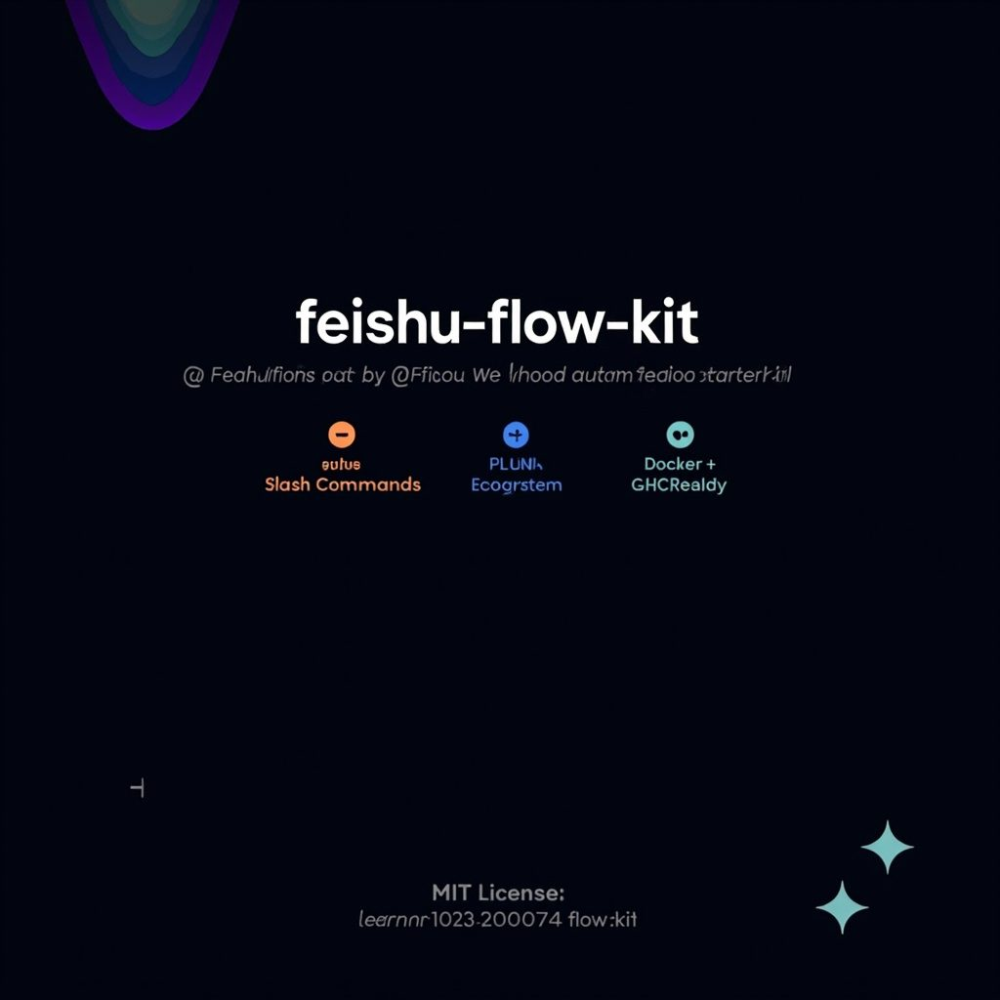
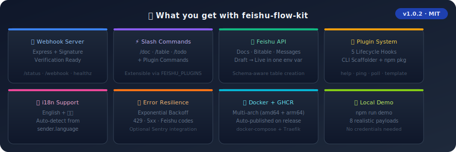
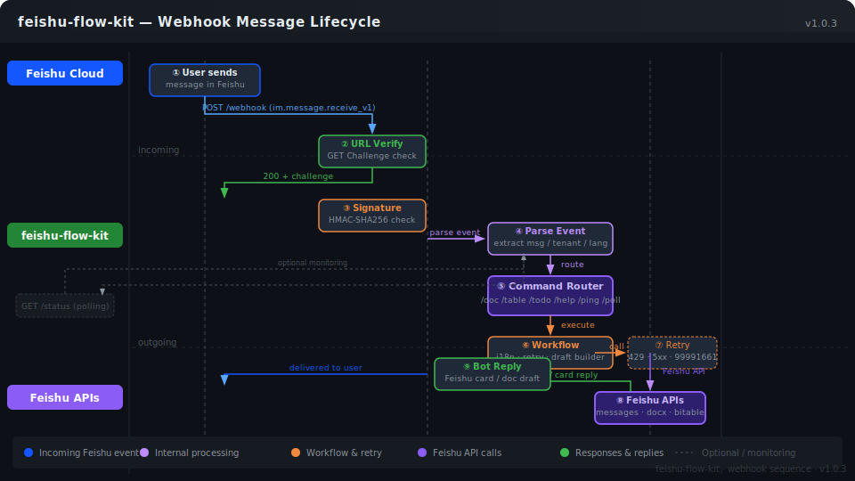
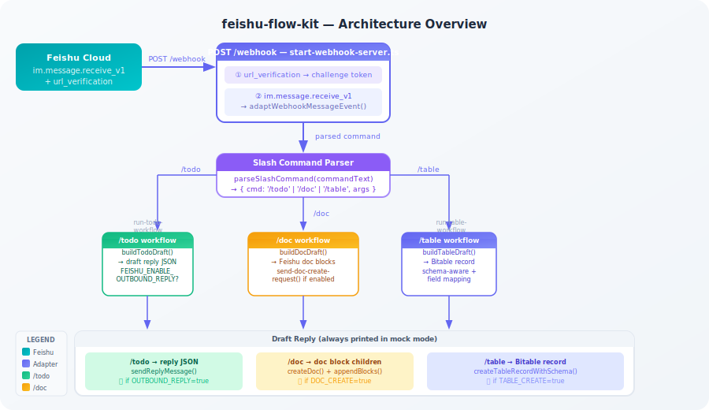
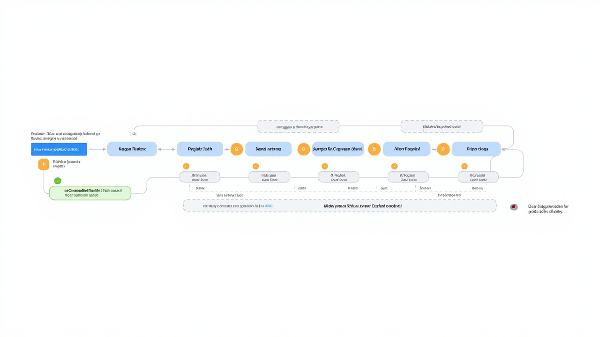

# feishu-flow-kit

[](https://github.com/learner20230724/feishu-flow-kit/actions/workflows/ci.yml) [](./LICENSE)

一个本地优先的 Feishu 自动化与 AI 工作流起步仓库。

> [English](./README.md) | 简体中文



## 为什么做这个

很多飞书自动化示例要么太窄，只覆盖一个小场景；要么强绑定某个内部环境；要么一上来就把工程复杂度拉满，不适合快速验证工作流。

这个项目想提供一个更干净的起点：
- 本地优先
- 结构清楚
- 不依赖很多基础设施
- 能自然长成真实工作流

## 它是什么

`feishu-flow-kit` 是一个围绕飞书生态的 starter repo，适合用来做：
- 消息驱动的自动化
- 机器人触发的工作流
- 飞书文档 / 表格辅助工具
- 轻量 AI 内部工具
- 先本地演示、后续再正式部署的 demo



## 包含内容

| 功能 | 内置 | 说明 |
|---|---|---|
| `/doc` — 创建飞书文档 | ✅ | 14 种 block 类型：段落、标题（1–6级）、无序列表、有序列表、待办事项、代码块（17种语言）、引用、分割线、标注 + 内联样式（粗体/斜体/代码/链接） |
| `/table` — 创建 Bitable 记录 | ✅ | Schema-aware，支持 10 种字段类型（text、number、date、checkbox、user、attachment、single/multi-select、linked_record），env 变量字段映射 |
| `/todo` — 结构化任务草稿 | ✅ | 纯文本，无凭证即可体验 |
| `/help`、`/ping`、`/poll` 插件 | ✅ | 同时提供完整插件系统，支持自定义命令 |
| i18n — 中英文自动检测 | ✅ | 根据 `event.sender.language` 自动切换 |
| 重试 + 容错机制 | ✅ | 自动重试 429 / 5xx / 飞书错误码 |
| `/status` 健康检查端点 | ✅ | `GET /status` 返回运行时长、事件计数、特性开关 |
| Webhook URL 验证 | ✅ | 自动处理 `url_verification` 挑战 |
| 签名验证 | ✅ | `x-lark-signature` 检查，含重放攻击时间窗口保护 |
| Mock 演示（无需凭证） | ✅ | `npm run demo` 本地触发所有路径 |
| 交互式 ASCII 演示 | ✅ | `node scripts/demo-interactive.mjs` — 终端动画导览 |
| Docker + GHCR 镜像 | ✅ | `ghcr.io/learner20230724/feishu-flow-kit:latest` |
| 生产环境部署指南 | ✅ | Traefik + Let's Encrypt，Railway / Render / fly.io |
| 本地 webhook 测试资产 | ✅ | 10 个真实 `im.message.receive_v1` JSON 样本 |
| Postman API 测试集 | ✅ | 导入 `docs/postman-collection.json` |
| 插件脚手架 CLI | ✅ | `node scripts/create-plugin.mjs <name>` |
| Table schema 映射预检 | ✅ | `npm run table:validate-mapping-config` |
| 环境安装验证脚本 | ✅ | `node scripts/verify-setup.mjs` |
| REST API 参考文档 | ✅ | `docs/api-reference.md` — 完整的端点文档 + cURL 示例 |



## 快速上手

**1. 安装**
```bash
git clone https://github.com/learner20230724/feishu-flow-kit.git
cd feishu-flow-kit
npm install
```

**2. 创建飞书应用** 在 [open.feishu.cn/app](https://open.feishu.cn/app) 创建应用并开启：
- 开启 **机器人** 能力
- 添加 **权限**：`im:message`、`docx:document`、`bitable:app`
- 在"事件订阅"中启用 `im.message.receive_v1`
- 将请求网址设置为你的服务器地址（例如 `https://your-host.com/webhook`）

**3. 配置** — 复制 `.env.example` 为 `.env` 并填入以下变量：

| 变量 | 获取位置 |
|---|---|
| `FEISHU_APP_ID` | 应用控制台 → 凭证与基础信息 → App ID |
| `FEISHU_APP_SECRET` | 应用控制台 → 凭证与基础信息 → App Secret |
| `FEISHU_VERIFICATION_TOKEN` | 应用控制台 → 事件订阅 → 验证令牌 |
| `FEISHU_ENCRYPT_KEY` | 应用控制台 → 事件订阅 → 加密密钥（可选） |

**4. 无需凭证，立即体验**
```bash
npm run demo         # 触发所有内置 + 插件命令的 mock 载荷
npm run demo:plugins # 同上，同时测试插件命令（/help、/ping、/poll）
```
> demo 脚本会启动服务器、POST 8 个模拟 webhook 载荷
>（`/hello`、`/doc`、`/table`、`/todo`、`/help`、`/ping`、`/poll`、URL 验证），
> 并打印服务器对每个载荷的响应——全程无需飞书应用或 ngrok。

**5. 正式运行**
```bash
npm run dev          # 本地开发（使用 mock 事件）
npm start            # 生产环境
```

服务运行后可尝试以下命令：
- `/doc weekly launch review` → 创建飞书文档并填充初始块
- `/table add backlog improve webhook errors / owner=alex` → 生成多维表格记录草稿

要开启真实的飞书 API 调用（而非仅生成草稿），在 `.env` 中设置 `FEISHU_ENABLE_OUTBOUND_REPLY=true`、`FEISHU_ENABLE_DOC_CREATE=true` 和/或 `FEISHU_ENABLE_TABLE_CREATE=true`。

如需接入你自己的多维表格，参见 [`docs/table-bitable-field-mapping.md`](./docs/table-bitable-field-mapping.md) 中的字段映射指南。

## Docker

镜像发布在 GitHub Container Registry，每次 release 和 `main` push 自动构建：

```bash
# 拉取最新版本
docker pull ghcr.io/learner20230724/feishu-flow-kit:latest

# 使用 .env 运行（容器内部端口 8787）
docker run -d --env-file .env -p 8787:8787 ghcr.io/learner20230724/feishu-flow-kit:latest

# 确认运行状态
curl http://localhost:8787/healthz
```

生产环境完整 docker-compose 配置（含公网域名、反向代理）见[部署指南](./docs/deployment.zh-CN.md#方式五--直接使用-ghcr-镜像)。

完整部署指南（Railway、Render、fly.io、Ubuntu）参见 [`docs/deployment.zh-CN.md`](./docs/deployment.zh-CN.md)。

## MVP 目标

- 小而易懂的项目结构
- 带类型的配置加载
- 可复用的 Feishu 事件 / 消息适配层
- 基础结构化日志
- 1 到 2 个真实可跑的工作流示例
- 不引入多余的平台仪式感

## 不做什么

- 不假装替代完整平台 SDK
- 不用过度抽象把 Feishu 的实际复杂度藏起来
- 不为简单场景强行引入重服务器架构

## 项目结构

```text
.
  README.md
  README.zh-CN.md
  src/
    core/
    adapters/
    workflows/
    config/
    server/
    types/
  examples/
  plugins/          # 插件模板（help-plugin、ping-plugin、poll-plugin、template/）
  scripts/          # 开发工具（create-plugin.mjs、validate-table-mapping-config.mjs）
  docs/
```

## 运行原理



> **流程：** Feishu 消息事件 → POST /webhook → 适配 payload → slash-command 解析器 → `/todo` / `/doc` / `/table` 工作流 → draft 回复（mock 模式下始终打印；开启功能开关后切换为真实 Feishu API 调用）。

以上全部可在本地用 mock 事件跑通。设置 `FEISHU_ENABLE_OUTBOUND_REPLY=true`、`FEISHU_ENABLE_DOC_CREATE=true` 或 `FEISHU_ENABLE_TABLE_CREATE=true`，即可把对应路径从 draft 模式切到真实 Feishu API 调用。对于 `/table`，还可以用 `FEISHU_BITABLE_LIST_FIELD_MODE=single_select` 或 `multi_select`、`FEISHU_BITABLE_OWNER_FIELD_MODE=user`、`FEISHU_BITABLE_ESTIMATE_FIELD_MODE=number`、`FEISHU_BITABLE_DUE_FIELD_MODE=date` 或 `datetime`、`FEISHU_BITABLE_DONE_FIELD_MODE=checkbox`，以及 `FEISHU_BITABLE_ATTACHMENT_FIELD_MODE=attachment`、`FEISHU_BITABLE_LINK_FIELD_MODE=linked_record`，逐步把字段映射从 text 扩到更贴近真实 Bitable 的 payload。如果你的 Bitable 字段名不是 starter 默认的 `Title / List / Details / ...`，现在也可以直接用 `FEISHU_BITABLE_TITLE_FIELD_NAME=Task`、`FEISHU_BITABLE_LIST_FIELD_NAME=Stage`、`FEISHU_BITABLE_SOURCE_COMMAND_FIELD_NAME=ChatCommand` 这类环境变量做字段名重映射，不用先改代码。

## 实战食谱

> 可直接复制使用的自动化模式，扩展飞书工作流能力。

参见 [`docs/recipes.zh-CN.md`](./docs/recipes.zh-CN.md)，包含七个实战食谱：投票机器人 `/poll`、FAQ 关键词自动回复、每日定时摘要 cron 任务、从模板自动创建文档 `/newdoc`、跨频道转发机器人、调用外部翻译 API 的 `/translate`，以及会议纪要提炼 `/summarize`。

## 插件系统

> 可扩展的斜杠命令 — 放入插件后立即可用。

插件从 `FEISHU_PLUGINS`（逗号分隔的模块标识符）加载，通过五个生命周期钩子运行：`register`、`beforeProcess`、`handle`、`onCommandResult`、`afterProcess`。内置插件（`/help`、`/ping`、`/poll`）随仓库附带；自定义插件放在 `plugins/<name>/` 下。

```bash
# 启用内置和自定义插件
FEISHU_PLUGINS=./plugins/help-plugin,./plugins/ping-plugin,./plugins/poll-plugin,my-custom-plugin
```

**快速上手：**
```bash
# 脚手架生成新插件
node scripts/create-plugin.mjs my-greeting
# → 创建 plugins/my-greeting/，含 index.ts、plugin.ts、.env.example、README.md
```

完整架构指南、生命周期钩子签名和插件编写参考见 [`docs/plugin-system.md`](./docs/plugin-system.md)。完整 CLI 脚手架演示见 [`docs/plugin-scaffolder-walkthrough.md`](./docs/plugin-scaffolder-walkthrough.md) — 展示脚手架生成的每个文件。快速命令查询见 [`docs/commands-reference.md`](./docs/commands-reference.md) — 所有内置命令和插件命令的完整示例。即用参考插件示例见 [`plugins/examples/`](./plugins/examples/README.md) — `/qr`、`/joke`、`/remind` 三个插件含完整内联注释源码。




### 插件示例库

三个可直接复制的生产级参考插件 — 复制到 `plugins/` 即可生效：

| 插件 | 命令 | 功能说明 |
|---|---|---|
| **qrcode-plugin** | `/qr [文字] [small\|medium\|large]` | 通过 QRServer API 生成二维码，以 Feishu 卡片形式返回图片。无需 API key。展示了 `beforeProcess()` 钩子、URL 构建和输入校验。 |
| **joke-plugin** | `/joke [分类]` | 从 JokeAPI v2（safe-mode）获取笑话，以格式化的 Feishu 卡片返回。展示了异步 HTTP 调用、`AbortController` 超时保护以及 `afterProcess()` 分析钩子。 |
| **remind-plugin** | `/remind <自然语言日期>` | 解析自然语言日期（`in 5 minutes`、`tomorrow at 09:00`、`every day at 18:00`），返回倒计时卡片。展示了正则解析、内存状态管理以及 `afterProcess()` 可扩展性。 |

👉 完整使用说明、环境变量和各插件生命周期钩子对比见 [`plugins/examples/README.md`](./plugins/examples/README.md)。

## Demo 资产


仓库里现在附带五张静态展示资产：前两张负责解释本地 runnable path，第三张展示 `/table` 的 schema handoff review flow，第四张把 schema review page 进一步压成一张更适合截图、外链和评审评论引用的单页图，第五张则收成更适合 README 首屏裁切、issue 链接和 setup note 引用的 share-card 尺寸。另外现在也补了独立的 HTML snapshot 页面：英文版 [`docs/table-schema-review-snapshot.html`](./docs/table-schema-review-snapshot.html) 和中文版 [`docs/table-schema-review-snapshot.zh-CN.html`](./docs/table-schema-review-snapshot.zh-CN.html)。后续如果要本地打开、截图，或在 issue / setup note 里引用，会比直接截 markdown 页面更顺手。现在也补了一个单独的发布向索引页 [`docs/table-schema-review-assets.md`](./docs/table-schema-review-assets.md)，用来快速判断三张 `/table` review 图分别适合拿去哪里引用、裁切或嵌入。如果后面改了 SVG 源文件，直接跑 `npm run docs:export-assets` 就能批量刷新三张 PNG；如果只想单独导出，也可以继续用 `npm run docs:export-svg-png -- docs/demo-table-schema-handoff-review.svg --out docs/demo-table-schema-handoff-review.png`、`npm run docs:export-svg-png -- docs/demo-table-schema-review-page.svg --out docs/demo-table-schema-review-page.png`，以及 `npm run docs:export-svg-png -- docs/demo-table-schema-review-share-card.svg --out docs/demo-table-schema-review-share-card.png`。

## 本地 demo

**交互式 ASCII 演示** — 无需凭证，先看终端动画导览？运行：

```bash
node scripts/demo-interactive.mjs        # 正常速度
node scripts/demo-interactive.mjs --speed=fast   # 快速版
```

动画展示服务器启动、webhook 事件到达、`/doc` 命令处理流程、飞书卡片响应全过程。

然后运行真实版本：

默认会以 mock 模式运行，并读取 `examples/mock-message-event.json`。你也可以用 `FEISHU_MOCK_EVENT_PATH` 切换示例输入，例如：

```bash
FEISHU_MOCK_EVENT_PATH=examples/mock-doc-message-event.json npm run dev
FEISHU_MOCK_EVENT_PATH=examples/mock-table-message-event.json npm run dev
FEISHU_MOCK_EVENT_PATH=examples/mock-table-rich-message-event.json FEISHU_BITABLE_LIST_FIELD_MODE=multi_select FEISHU_BITABLE_OWNER_FIELD_MODE=user FEISHU_BITABLE_ESTIMATE_FIELD_MODE=number FEISHU_BITABLE_DUE_FIELD_MODE=datetime FEISHU_BITABLE_DONE_FIELD_MODE=checkbox FEISHU_BITABLE_ATTACHMENT_FIELD_MODE=attachment FEISHU_BITABLE_LINK_FIELD_MODE=linked_record npm run dev
```

当前 demo 路径是：

1. 加载带类型的配置
2. 读取一条 mock Feishu 消息事件
3. 解析 `/todo ...`、`/doc ...` 或 `/table ...` 这样的 slash command
4. 运行最小 workflow
5. 输出 reply draft

目前仓库里已经可直接演示的命令：
- `/todo ship webhook adapter`
- `/doc weekly launch review`
- `/table add backlog item: improve webhook errors / owner=alex`
- `/table add backlog improve webhook errors / owner_open_id=ou_xxx`
- `/table add sprint fix flaky webhook tests / estimate=5`
- `/table add sprint fix flaky webhook tests / due=2026-04-01`
- `/table add sprint close flaky webhook tests / done=true`
- `/table add sprint share demo pack / attachment_token=file_v2_demo123,file_v2_demo456`
- `/table add sprint,urgent flaky webhook tests / owner_open_id=ou_xxx / estimate=5 / due=2026-04-01T09:30:00Z / done=true`
- `/table add sprint ship follow-up / link_record_id=recA123,recB456`

如果你已经整理好一份真实 Bitable 字段清单 JSON，也可以先直接生成一版 env 映射草稿：

```bash
npm run table:mapping-draft -- examples/table-schema-sample.json
npm run table:mapping-draft -- examples/table-schema-partial.json --format json
npm run table:mapping-draft -- examples/table-schema-unmatched.json --format json --out ./table-mapping-draft.json
```

如果你手上拿到的是 Feishu 字段列表 API 的原始响应，而不是已经整理好的 `fields` 数组，可以先做一次标准化。现在标准化输出也会顺手保留少量 raw-property review hints，比如 `rawSemanticType`、`dateFormatter`、`linkedTableId`、`optionCount` 和 `sourceProperty`，这样 handoff 时不容易把 date/datetime、linked table 这些细节悄悄抹平：

```bash
npm run table:normalize-feishu-fields -- examples/feishu-fields-list-response.json
npm run table:normalize-feishu-fields -- examples/feishu-fields-list-response.json --out ./table-schema-from-feishu.json
npm run table:mapping-draft -- ./table-schema-from-feishu.json --format json
```

如果你要校验的是一份准备真实 rollout 的 `.env`，更推荐直接把目标 env 文件一起带上：

```bash
npm run table:validate-mapping-config -- examples/feishu-fields-normalized-schema-advanced.json --env-file examples/table-mapping-advanced.env
npm run table:validate-mapping-config -- examples/feishu-fields-normalized-schema-advanced.json --env-file examples/table-mapping-advanced.env --strict-raw
```

默认模式适合做较温和的 preflight gate：像 `datetime`→`date`、`DuplexLink`→`linked_record` 这类 raw-semantic drift 会被保留成 warning，而不是直接失败。如果你希望 release 或 CI 在这些语义漂移上直接卡住，就加 `--strict-raw`。

仓库里也附带了两条完整的 handoff fixture chain，可直接复查：
- `examples/feishu-fields-list-response.json` / `examples/feishu-fields-normalized-schema.json` / `examples/feishu-fields-mapping-draft.json` → baseline 样例链路
- `examples/feishu-fields-list-response-advanced.json` / `examples/feishu-fields-normalized-schema-advanced.json` / `examples/feishu-fields-mapping-draft-advanced.json` → advanced raw-fidelity 样例链路，并补了一段可直接复用到 setup notes、PR review、schema handoff comments 的短 excerpt，专门把 `optionCount`、`datetime` formatter 漂移、`DuplexLink` relation shape 摘出来

如果你想快速确认仓库里提交的 handoff 产物仍和当前 CLI 行为一致，并同时覆盖这两条链路、独立的 select-option override sample，以及它的最小 shape contract，可以直接跑：

```bash
npm run verify:table-schema-handoff
```

默认输出适合直接拷进 `.env`。如果你想把匹配结果接进别的脚本、保留结构化审查记录，或者明确看到 unmatched 字段，改用 `--format json` 更合适。现在 JSON draft 里也会额外给出一个很小的 `reviewWarnings` 区块，专门把 raw-vs-normalized 语义漂移显式标出来，避免像 raw `datetime` / `single_link` 这种信息在 handoff 里悄悄被折叠成通用的 `date` / `linked_record`。而对 select 列这类更常需要单独 rollout note 的场景，现在同一份 JSON 也会额外给出 `selectOptionReviewDrafts`，把 option label sample、精简后的 raw excerpt，以及 label→option-id remap draft 单独收出来，后续复用时不用自己再从完整 warning 列表里筛；其中 `optionRemapDraft` 现在还多了一段很小的 `overrideExample` label→option-id map，让这份 rollout 资产更接近可直接复制，而不只是可审查。输入 JSON 的约定和 sample variants 已单独写在 [`/table` mapping generator input guide](./docs/table-mapping-generator-inputs.md)，完整审查路径见 [`/table` schema handoff demo](./docs/table-schema-handoff-demo.md)，现在也把更小的 select rollout 资产单独拆成了 [`/table` select-option handoff asset](./docs/table-select-option-handoff.md)，并新增了 [`/table` select-option override schema draft](./docs/table-select-option-override-schema.md) 作为后续实现层可对齐的最小约定；另外还补了一页更适合引用和快速做 `.env` 决策的英文 [`/table` schema review page](./docs/table-schema-review-page.md) 与中文版 [`/table` schema review 页面](./docs/table-schema-review-page.zh-CN.md)，也新增了一页专门讲 rollout 前 env/schema 校验的 [`/table` mapping config preflight`](./docs/table-mapping-config-preflight.zh-CN.md)，人工复核清单见 [`/table` schema handoff review checklist](./docs/table-schema-handoff-review-checklist.md)。

当前 mock 输入示例：
- `examples/mock-message-event.json` → `/todo` 流程
- `examples/mock-doc-message-event.json` → `/doc` 流程
- `examples/mock-table-message-event.json` → `/table` text-first 流程
- `examples/mock-table-rich-message-event.json` → `/table` richer field-mode 流程（`multi_select` + `user` + `number` + `datetime` + `checkbox` + `attachment` + `linked_record`）
- `examples/webhook-table-rich-event.json` + `examples/webhook-table-rich-response.json` → fixture-backed `/table` webhook 成功示例
- `examples/webhook-invalid-payload.json` + `examples/webhook-invalid-response.json` → fixture-backed invalid webhook 失败示例
- `examples/table-api-error-field-not-found.json` → fixture-backed 字段不存在失败示例
- `examples/table-api-error-type-mismatch.json` → fixture-backed 字段类型不匹配失败示例
- `examples/table-api-error-permission-denied.json` → fixture-backed Bitable 写权限失败示例
- `examples/table-schema-sample.json` / `examples/table-schema-partial.json` / `examples/table-schema-localized.json` / `examples/table-schema-unmatched.json` → mapping generator 输入样例，分别覆盖 happy path、首轮少字段接入、多语言列名审查、额外 unmatched 列审查
- `examples/feishu-fields-list-response.json` / `examples/feishu-fields-normalized-schema.json` / `examples/feishu-fields-mapping-draft.json` → 从原始字段响应到 review artifact 的 schema handoff 样例链路

这个 demo 刻意保持很小，但已经足够证明仓库能把真实输入跑过一条清楚、可读的本地链路。

## 当前 webhook slice

仓库现在已经有一条最小可用的 Feishu 本地 webhook 路径。

当前范围：
- 提供 `GET /healthz` 方便做本地存活检查
- 提供 `POST /webhook`
- 支持处理 `url_verification`
- 接收最小 `im.message.receive_v1` payload
- 把原始 callback 适配成仓库内部统一的 `message.received` 事件
- 运行现有 demo workflow，并返回 draft reply JSON
- 当 `FEISHU_ENABLE_OUTBOUND_REPLY=true` 且 app 凭据齐全时，可选发送真实 Feishu 文本回复
- 当 `FEISHU_ENABLE_DOC_CREATE=true` 且 app 凭据齐全时，可选从 `/doc` workflow 创建真实 Feishu 文档
- 创建文档后，还可以继续追加一段最小 starter body，支持 heading / bullet / todo / paragraph 等原生 block，避免新文档是空的
- `/webhook` 对非 POST 请求返回明确的 `405`
- 当配置 `FEISHU_WEBHOOK_SECRET` 时，可选校验 `x-lark-request-timestamp` 与 `x-lark-signature`
- 会拒绝超出可配置 replay window 的签名请求

当前限制：
- 签名校验仍刻意保持很小，不是生产级安全审计的替代品
- outbound reply 仍是显式 opt-in，只覆盖最简单的文本回复路径
- doc create 也还是 starter 级：block append 目前支持 heading1/2/3、bullet list、todo（含 checked 状态）和普通 paragraph，并且在 paragraph / bullet / todo / heading 文本里保留行内 markdown 格式（**粗体**、*斜体*、`代码`、~~删除线~~、`[文字](url)` 链接）
- token cache 目前只是一个很小的内存缓存，还没有 refresh daemon、持久化或并发去重
- 当前只覆盖了较窄的一段消息 payload

这已经足够做本地联调与 repo 级结构验证，但仍然是一个 starter implementation。

## 测试

```bash
npm run check
npm test
```

当前测试覆盖：
- slash command 解析
- `/todo`、`/doc` 与 `/table` 的 demo workflow 行为
- webhook payload 适配
- webhook 签名生成与校验
- outbound reply request draft 生成
- 最小 tenant token 获取 + 文本 reply sender 流程
- webhook `/doc` 路径里的最小 Feishu doc create 与 starter richer-block append 流程
- 最小 Bitable create-record 请求，以及 webhook `/table` 路径的 opt-in 真实写入链路
- `GET /healthz` 与 `POST /webhook` 的本地 HTTP 行为

## 可继续扩展的 workflow 方向

仓库里已经能直接跑的：
- `/todo ...` → 把请求整理成一个简短 action-list draft
- `/doc ...` → 把主题转成 markdown 风格 outline，并可进一步创建 Feishu 文档、追加最小原生 docx 正文（headings / bullets / todos / paragraphs）
- `/table ...` → 把一段短的 record 请求转成 Bitable create-record draft（本地优先，真实写入显式 opt-in；当前已可通过配置把 `List` 扩到 single-select 或 multi-select、把 `Owner` 扩到 user payload、把 `Estimate` 扩到 number payload、把 `Due` 扩到 date/datetime 时间戳 payload、把 `Done` 扩到 checkbox payload、把 `Attachment` 扩到 file-token attachment payload，并把 `LinkedRecords` 扩到 linked-record payload；同时也支持用环境变量把 starter 字段名重映射到真实表结构）

下一批比较合适的方向：
- 将选定的飞书内容同步到本地 markdown 工作区
- 从结构化聊天命令触发一个小型审批辅助流程

## 为什么优先本地

对于早期工具，本地优先通常更适合：
- 配置更少
- 调试更快
- 移动部件更少
- 更适合做公开示例

后续如果需要，再补 deployment pieces 就可以。

## 文档

- [Setup guide](./docs/setup-guide.md)
- [Architecture overview](./docs/overview.md)
- [部署指南](./docs/deployment.zh-CN.md) — Railway / Render / fly.io / 手动 Ubuntu
- [REST API 参考文档](./docs/api-reference.zh-CN.md) — 完整端点文档、HMAC 安全验证、环境变量及 cURL 示例
- [`/table` 字段映射说明](./docs/table-bitable-field-mapping.md)
- [`/table` schema mapping worksheet](./docs/table-schema-mapping-worksheet.md)
- [`/table` mapping generator input guide](./docs/table-mapping-generator-inputs.md)
- [`/table` schema handoff demo](./docs/table-schema-handoff-demo.md)
- [`/table` schema review page](./docs/table-schema-review-page.md)
- [`/table` schema review 页面（中文）`](./docs/table-schema-review-page.zh-CN.md)
- [`/table` mapping config preflight（配置预检）`](./docs/table-mapping-config-preflight.zh-CN.md)
- [`/table` select-option handoff 资产`](./docs/table-select-option-handoff.md)
- [`/table` webhook 成功 / 失败示例](./docs/table-webhook-success-error-demo.md)
- [Webhook 事件字段参考](./docs/webhook-field-reference.md)
- [`/table` API error fixture 资产包](./docs/table-api-error-fixtures.md)
- [按 API 报错模式排查](./docs/troubleshooting-by-api-error-pattern.md)
- [安全策略](./SECURITY.md) — Webhook 签名校验、凭证管理、部署安全加固、事件响应
- [参与贡献指南](./CONTRIBUTING.md) — 本地开发环境搭建、添加命令、插件开发、PR 检查清单
- [GitHub 仓库元数据](./docs/github-repo-meta.md)
- [无浏览器环境下发布到 GitHub](./docs/publish-to-github.md)

## 参与贡献

贡献范围、本地运行方式和 PR 预期见 [CONTRIBUTING.md](./CONTRIBUTING.md)。

## 路线图

- [x] 建最小 TypeScript 项目骨架
- [x] 定义配置 schema
- [x] 加入基础 mock event runner
- [x] 加入 slash-command parsing 示例
- [x] 加入面向真实 webhook / bot payload 的 Feishu adapter interface
- [x] 再补一个可运行 workflow 示例
- [x] 写清 setup guide 与真实约束
- [x] 把 `/doc` block append 从纯 paragraph 升级到 starter richer docx blocks
- [x] 补截图或 demo 图

## 写法与范围说明

这个仓库应该保持实用。不要夸张 AI 话术，不要伪造产品成熟度，也不要用空泛的“agent 魔法”掩盖真实边界。

目标很简单：让 Feishu workflow 实验更容易开始，也更容易公开分享。

## Star history

[](https://star-history.com/#learner20230724/feishu-flow-kit&Date)

## License

MIT，见 [LICENSE](./LICENSE)。
